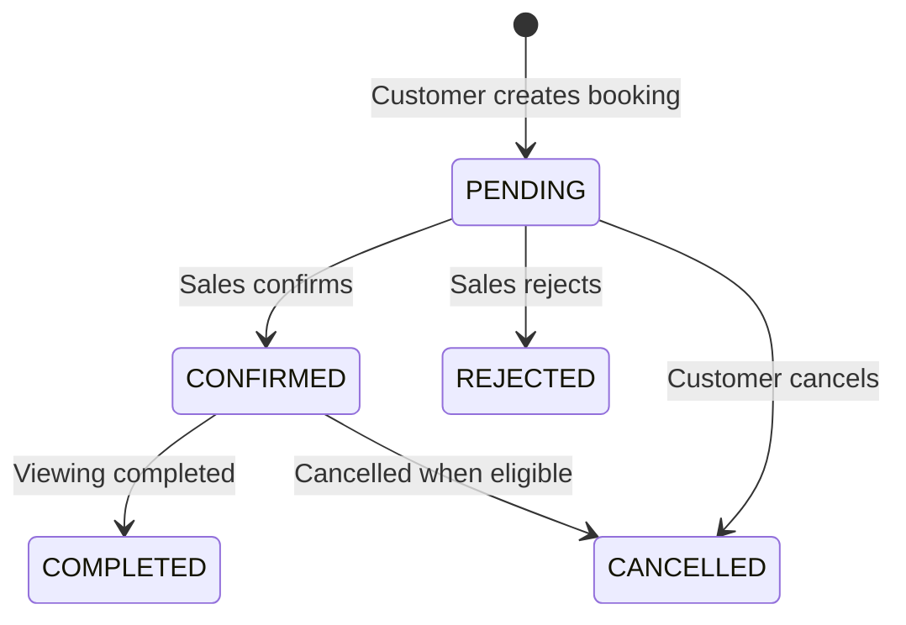
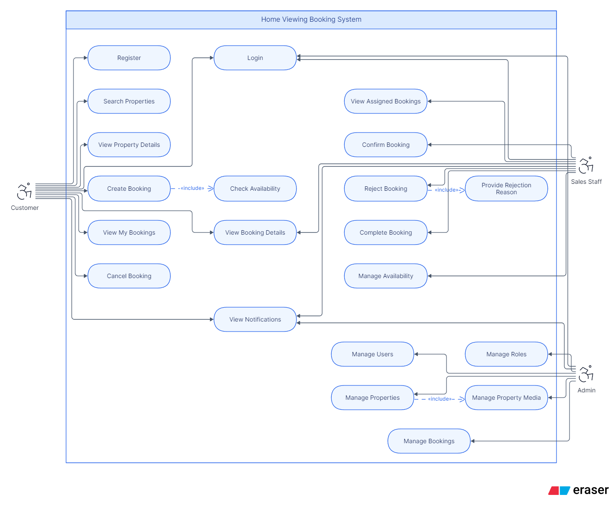
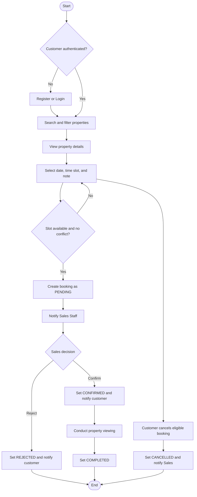
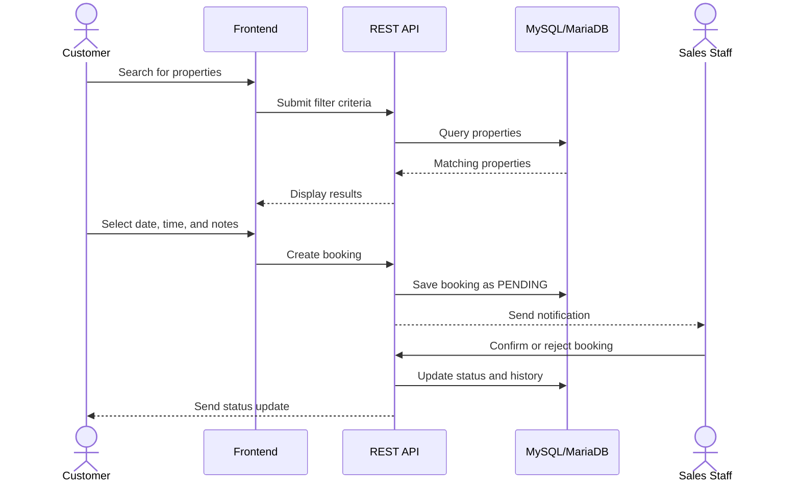
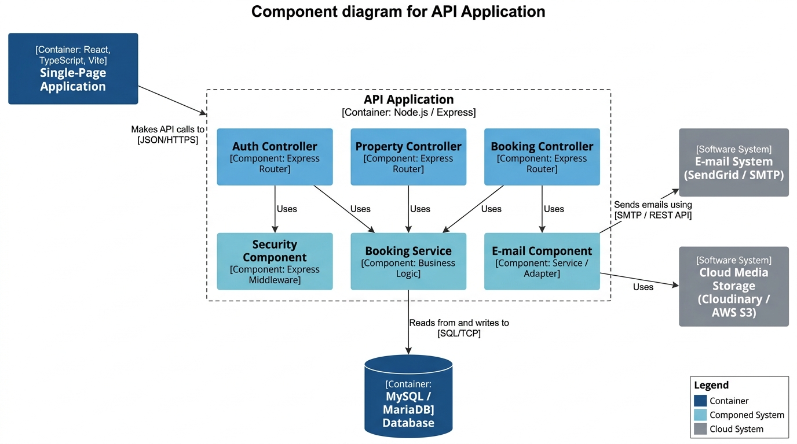
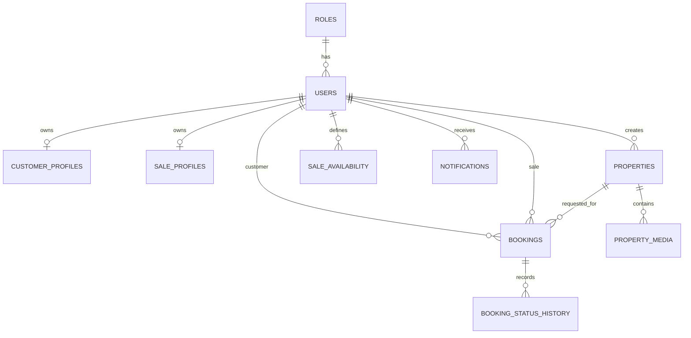

# 🏠 Home Viewing Booking System


A web-based system that helps customers search for properties, schedule home viewings, and track appointment status. Sales staff manage their availability and handle bookings, while administrators manage users, properties, and system activity.

> **Phase 1 objective:** build a clear, trackable, and extensible home-viewing workflow without overcomplicating the MVP.

## Table of Contents

- [Overview](#-overview)
- [Problem and Objective](#-problem-and-objective)
- [Features by Role](#-features-by-role)
- [MVP Scope](#-mvp-scope)
- [High-Priority Features to Implement First](#high-priority-features-to-implement-first-48)
- [Use Cases](#-use-cases)
- [Activity Diagram](#-activity-diagram)
- [Sequence Diagram](#-sequence-diagram)
- [Visual Documentation](#-visual-documentation)
- [Database Architecture](#-database-architecture)
- [UI/UX Overview](#-uiux-overview)
- [Technology Stack](#-technology-stack)
- [Installation](#-installation)

## 📌 Overview

| Item | Description |
| --- | --- |
| Project | Home Viewing Booking System |
| Users | Customer, Sales Staff, Admin |
| Main flow | Find property → choose time → create booking → sales confirmation → completion |
| Booking statuses | `PENDING`, `CONFIRMED`, `REJECTED`, `CANCELLED`, `COMPLETED` |
| Release stage | Phase 1 MVP |

## 🎯 Problem and Objective

Traditional home-viewing processes often depend on phone calls, messages, and manual records. This can lead to overlapping schedules, inconsistent information, poor status visibility, and delayed customer updates.

The system centralizes the complete workflow:

```text
Find property → View details → Select date/time → Create booking
       → Sales confirmation or rejection → View property → Complete
```

## 👥 Features by Role

| Role | Main capabilities |
| --- | --- |
| **Customer** | Register/login, search and filter properties, view details, create bookings, view history, cancel eligible bookings, receive notifications |
| **Sales Staff** | Login, define availability, view assigned bookings, confirm/reject/complete bookings, add notes, view customer information |
| **Admin** | Manage users and roles, activate/deactivate accounts, manage properties and media, monitor bookings and booking history |

## 🚀 MVP Scope

- User and role management with `ADMIN`, `SALE`, and `CUSTOMER`.
- Property management covering property type, address, price, area, bedrooms, bathrooms, status, and media.
- Property search and filtering by city, district, price, area, bedrooms, and property type.
- Viewing bookings with date, start time, end time, and customer notes.
- Sales availability by working day and time slot.
- Booking history recording the previous status, new status, actor, reason, and timestamp.
- Notifications when a booking is created, confirmed, rejected, cancelled, or completed.

### Booking lifecycle



Out of scope for Phase 1: AI agents, automatic sales ranking, route optimization, automatic rescheduling, external calendar synchronization, behavioral analytics, and advanced reviews.

## High-Priority Features to Implement First (48)

| No. | Module | Feature | Impact | Short Description |
| ---: | --- | --- | --- | --- |
| 1 | Authentication | Customer registration | High | Create a customer account with email, password, name, and phone. |
| 2 | Authentication | Email uniqueness validation | High | Prevent duplicate accounts using the same email address. |
| 3 | Authentication | Password hashing | High | Store passwords securely with bcrypt hashing. |
| 4 | Authentication | Customer login | High | Authenticate customers and return a JWT access token. |
| 5 | Authentication | Sales login | High | Allow sales staff to access booking operations securely. |
| 6 | Authentication | Admin login | High | Allow administrators to access protected management functions. |
| 7 | Authentication | JWT verification middleware | High | Validate bearer tokens before protected API requests. |
| 8 | Authentication | Role-based authorization | High | Restrict actions to `CUSTOMER`, `SALE`, or `ADMIN` roles. |
| 9 | Authentication | Current user profile | Medium | Return the authenticated user's profile and role. |
| 10 | Authentication | Account activation status | High | Block inactive accounts from authenticated operations. |
| 11 | Property | Property listing | High | Display available properties with essential summary information. |
| 12 | Property | Property detail | High | Show complete property information and media gallery. |
| 13 | Property | Keyword search | High | Search properties by title, address, or district. |
| 14 | Property | City filtering | Medium | Filter available properties by city. |
| 15 | Property | District filtering | High | Filter available properties by district. |
| 16 | Property | Price range filtering | High | Filter properties by minimum and maximum price. |
| 17 | Property | Area filtering | Medium | Filter properties by minimum area. |
| 18 | Property | Bedroom filtering | Medium | Filter properties by minimum bedroom count. |
| 19 | Property | Property type filtering | High | Filter by apartment, house, villa, or townhouse. |
| 20 | Property | Property pagination | Medium | Return property results with page, limit, and total pages. |
| 21 | Property | Admin property creation | High | Let admins create a new available property listing. |
| 22 | Property | Property media management | Medium | Attach ordered image media and identify the primary image. |
| 23 | Availability | Sales availability listing | High | Show available time slots for a sales staff member. |
| 24 | Availability | Sales availability configuration | High | Let sales staff create or replace their working time slots. |
| 25 | Availability | Day-of-week validation | High | Validate that availability uses the database weekday range `1..7`. |
| 26 | Availability | Time-range validation | High | Reject availability slots where end time is not after start time. |
| 27 | Availability | Public sales availability | High | Allow customers to view a sales staff member's public slots. |
| 28 | Booking | Customer booking creation | Critical | Create a viewing request for a property, date, and time slot. |
| 29 | Booking | Assigned sales resolution | Critical | Use the property's assigned sales staff when no sales ID is supplied. |
| 30 | Booking | Future booking date validation | High | Reject bookings scheduled in the past or with invalid dates. |
| 31 | Booking | Slot availability validation | Critical | Ensure the selected time is inside the sales availability schedule. |
| 32 | Booking | Double-booking prevention | Critical | Reject overlapping pending or confirmed bookings. |
| 33 | Booking | ACID booking transaction | Critical | Save booking, status history, and notification atomically. |
| 34 | Booking | Pending booking status | High | Set every newly created booking to `PENDING`. |
| 35 | Booking | Customer booking list | High | Show bookings belonging only to the authenticated customer. |
| 36 | Booking | Sales booking list | High | Show bookings assigned only to the authenticated sales staff. |
| 37 | Booking | Admin booking list | High | Let admins monitor all bookings in the system. |
| 38 | Booking | Booking detail and audit trail | High | Show booking information and immutable status history. |
| 39 | Booking | Confirm booking | High | Allow sales staff to transition `PENDING` to `CONFIRMED`. |
| 40 | Booking | Reject booking with reason | High | Allow sales staff to reject a request and record the reason. |
| 41 | Booking | Customer cancellation | High | Allow customers to cancel eligible pending or confirmed bookings. |
| 42 | Booking | Complete viewing | Medium | Allow sales staff to transition a confirmed viewing to `COMPLETED`. |
| 43 | Notification | Booking-created notification | High | Notify sales staff when a new booking is created. |
| 44 | Notification | Status-change notification | High | Notify the relevant user after a booking status transition. |
| 45 | Notification | Notification inbox | Medium | List notifications belonging to the authenticated user. |
| 46 | Notification | Mark notification as read | Medium | Update the read state of a user's notification. |
| 47 | Quality and Security | API integration tests | High | Verify HTTP status codes, validation, authentication, and protected routes. |
| 48 | Quality and Security | Contract and build validation | High | Keep SQL schema, OpenAPI, backend, frontend, and production builds aligned. |

## 🧩 Use Cases

The use-case model below follows `docs/use_case.png` and defines the system boundary, three actors, the main booking operations, and the explicit `include` relationships.



| Actor | Use cases |
| --- | --- |
| **Customer** | Register, login, search properties, view property details, create booking, check availability, view my bookings, view booking details, cancel booking, view notifications |
| **Sales Staff** | Login, view assigned bookings, view booking details, confirm booking, reject booking, provide rejection reason, complete booking, manage availability, view notifications |
| **Admin** | Login, manage users, manage roles, manage properties, manage property media, manage bookings, view notifications |

## 🔄 Activity Diagram

The booking activity must follow this order: authenticate customer → search property → view details → choose an available slot → validate availability and conflicts → create a pending booking → notify sales → sales confirms or rejects → update status and notify customer.



## 🔁 Sequence Diagram



## 🗺️ Visual Documentation

### Product mindmap

The mindmap describes the product scope, feature groups, MVP entities, key relationships, and UI/UX direction.


### Workflow and use-case diagrams





### Design files and source documents

- [View the wireframe PDF](docs/wireframe.pdf)
- [Open the original Figma wireframe file](docs/wireframe.fig)
- [View the database/system diagram PDF](docs/Diagram%20-%20localhost.pdf)
- [View the product requirements document](docs/prd.txt)

> GitHub renders the PNG images directly in this README. The PDF and `.fig` files are provided as links to preserve their quality and allow downloading or editing.

## 🗄️ Database Architecture

```text
HOME BOOKING SYSTEM
├── User Management: roles, users, customer_profiles, sale_profiles
├── Property Management: properties, property_media
├── Schedule Management: sale_availability
└── Booking Management: bookings, booking_status_history, notifications
```

| Table | Responsibility |
| --- | --- |
| `roles` | System roles |
| `users` | User accounts and authentication data |
| `customer_profiles` / `sale_profiles` | Role-specific profile information |
| `properties` / `property_media` | Properties and media |
| `sale_availability` | Sales availability schedule |
| `bookings` | Property viewing appointments |
| `booking_status_history` | Booking status history |
| `notifications` | User notifications |

### ERD overview



```text
bookings.customer_id → users.id
bookings.property_id → properties.id
bookings.sale_id     → users.id
```

## 🖥️ UI/UX Overview

### Customer flow

`Home → Property Search → Property List → Property Details → Select Date & Time → Booking Confirmation → Booking Status`

| Screen | Content |
| --- | --- |
| Home/Search | Search, filters, and available properties |
| Property List | Image, title, location, price, area, and bedrooms |
| Property Details | Gallery, address, details, description, and booking action |
| Booking | Date, start/end time, and customer note |
| My Bookings | Bookings, statuses, history, and cancellation actions |
| Sales Dashboard | Daily schedule, customer information, and booking actions |

Design principles: keep the `Search → Property → Book` flow short, make statuses easy to understand, support desktop/mobile layouts, and maintain consistent UI components.

## 🧰 Technology Stack

| Layer | Technology |
| --- | --- |
| Frontend | React, TypeScript, Vite, responsive CSS |
| Backend | REST API, authentication, role-based access control |
| Database | MySQL 8.0+ or MariaDB, foreign keys, indexes, transactions |
| Tools | Git/GitHub, Figma, Navicat, Mermaid |

## ⚡ Installation

### Requirements

- Node.js 18+
- pnpm 8+ or npm 9+
- MySQL 8.0+ / MariaDB when connecting to the backend

### Run the backend API

```bash
cd backend
pnpm install
pnpm dev
```

The API runs at `http://localhost:5000`; check `http://localhost:5000/api/health`.

### Run the frontend

```bash
cd frontend
pnpm install
pnpm dev
```

Open the Vite URL shown in the terminal, usually `http://localhost:5173`.

### Build and initialize the database

```bash
cd backend
pnpm build

cd ..
mysql -u <username> -p <database_name> < database/booking.sql
```

The sample schema is available at [`database/booking.sql`](database/booking.sql). Configure the backend database connection through environment variables before starting the API.

## 🛣️ Roadmap

1. Complete the REST API and authentication.
2. Connect the frontend to the database through the API.
3. Add schedule-conflict validation and transactions when creating bookings.
4. Add real-time or email notifications.
5. Expand post-MVP features based on real usage data.

## 📄 License

This is an academic/prototype project for research and product development purposes.