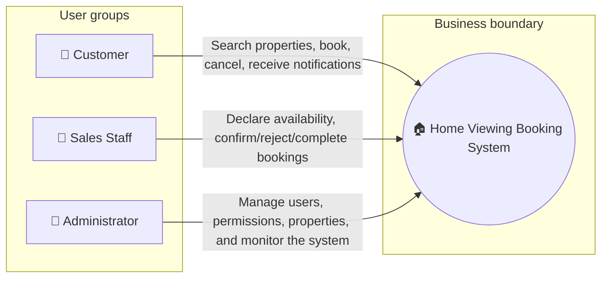
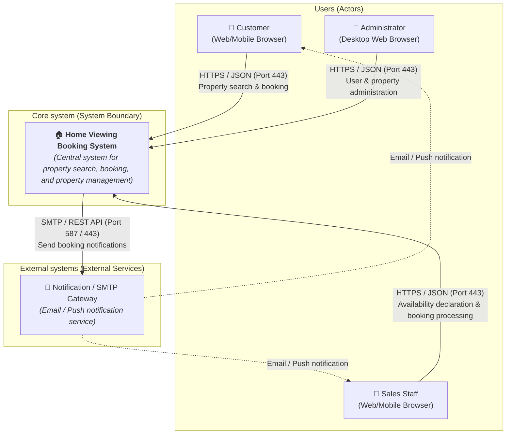
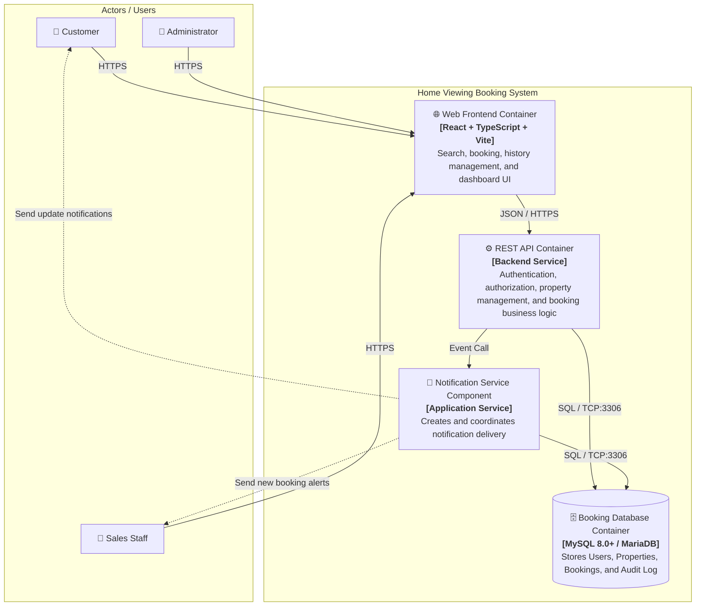
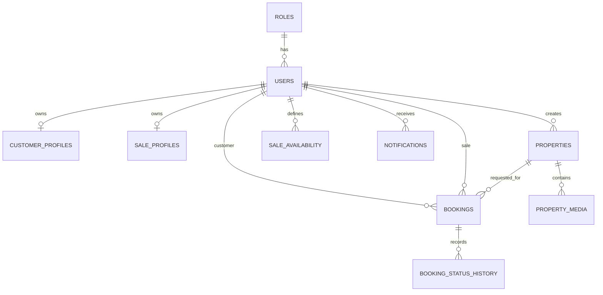
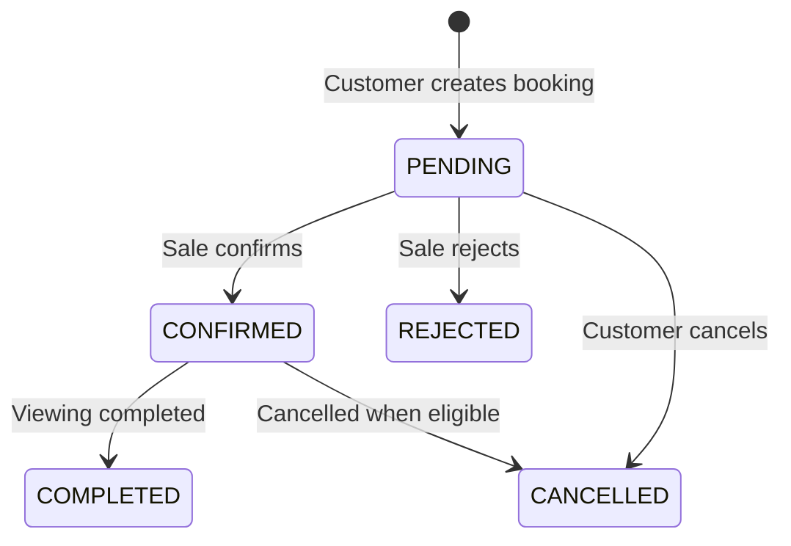
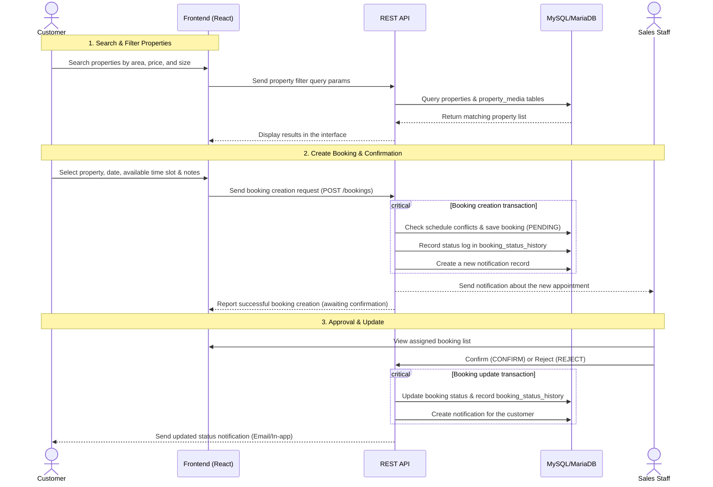

# 📐 SYSTEM ARCHITECTURE DOCUMENT (ARC42)
## Project: Home Viewing Booking System
* **Version:** Phase 1 (MVP)
* **Status:** Prototype / Academic & Research

---

## 1. Introduction and Goals

### 1.1. Problem Statement
The traditional real estate viewing booking process relies mainly on phone calls, fragmented messages, and manual record keeping. This leads to:
* Duplicate appointments between customers and sales staff.
* Inconsistent property and schedule information.
* Limited ability to track appointment progress/status in real time.
* Delayed responses to customers.

### 1.2. System Goals
The **Home Viewing Booking System** focuses on digitizing and standardizing the entire business workflow:
$$\text{Search Properties} \rightarrow \text{View Details} \rightarrow \text{Select Date/Time} \rightarrow \text{Create Booking} \rightarrow \text{Sales Confirm/Reject} \rightarrow \text{View Property} \rightarrow \text{Complete}$$

* **Phase 1 (MVP) goal:** Build a clear, trackable, and extensible home viewing booking process without making the MVP scope unnecessarily complex.

### 1.3. Stakeholders

| Stakeholder (Role) | Main Expectations / Responsibilities |
| :--- | :--- |
| **Customer** | Register/log in, search and filter properties, view detailed information, book a viewing, manage booking history, cancel eligible bookings, and receive notifications. |
| **Sales Staff** | Log in, configure availability, receive assigned bookings, approve/reject/complete appointments, add notes, and view customer information. |
| **Admin** | Manage users and permissions, activate/deactivate accounts, manage property listings and media, and monitor all activity and booking history. |

### 1.4. Core Quality Goals
1. **Data Integrity:** Ensure that bookings, status history, and notifications are recorded consistently through a Database Transaction.
2. **Usability:** Keep the `Search → View Property → Book` flow short and intuitive, with support for multiple devices (Desktop & Mobile).
3. **Extensibility:** Use a clearly layered architecture that is ready to integrate advanced features (AI, Calendar synchronization) after Phase 1.

---

## 2. Architecture Constraints

### 2.1. Technical Constraints
* **Frontend:** React 18+, TypeScript 5+, Vite, Responsive CSS.
* **Backend:** Layered RESTful API architecture with role-based access control (RBAC).
* **Database:** MySQL 8.0+ or MariaDB, with mandatory Foreign Keys, Indexes, and ACID Transactions.
* **Node Environment:** Node.js 18+, Package Manager: `pnpm 8+` or `npm 9+`.

### 2.2. Phase 1 (MVP) Scope Constraints
* **In-Scope:** RBAC management (`ADMIN`, `SALE`, `CUSTOMER`), property and media CRUD, property filters, booking by Sales availability slots, booking status lifecycle and immutable history management, and a basic notification system.
* **Out-of-Scope:** AI agents, automatic Sales ranking, route optimization, automatic rescheduling, Google/Outlook Calendar synchronization, user behavior analytics, and an advanced rating system.

---

## 3. System Scope and Context

### 3.1. Business Context
The business context defines the boundary between the **Home Viewing Booking System** and the user actors who interact with it during the home viewing booking process.



### 3.2. Technical Context (C4 Level 1: System Context Diagram)
The technical context describes the system at an overall (Black-Box) level, including communication channels and connection protocols with users and external services.



#### Technical Interfaces:

| Interface / Channel | Protocol / Port | Data Format | Connection Purpose |
| :--- | :--- | :--- | :--- |
| **Web Client $\rightarrow$ System** | HTTPS / TLS (Port 443) | JSON / HTTP REST | Users access the Web interface and send search and booking requests. |
| **System $\rightarrow$ Email Gateway** | SMTP / TLS (Port 587) or HTTPS API | MIME / JSON | Send automated notifications (booking creation, approval, rejection, cancellation). |

---

## 4. Solution Strategy

| Architectural Aspect | Technical Decision | Rationale / Benefit |
| :--- | :--- | :--- |
| **Application architecture** | Separate Frontend (SPA) and Backend REST API | Ensures independence, simplifies upgrades, and standardizes communication through HTTP/JSON. |
| **User interface** | React 18 + TypeScript + Vite | Fast build/HMR, type safety to reduce runtime errors, and componentized UI. |
| **Storage & Data** | MySQL 8.0+ / MariaDB (Relational DB) | Ensures relational data integrity (FKs) and supports ACID Transactions for bookings. |
| **Immutable history** | Dedicated `booking_status_history` table | Records the complete status change trail (who changed what, why, and when) for an audit trail. |
| **Booking processing** | Encapsulated in 1 Transaction | Check conflicts $\rightarrow$ create `PENDING` booking $\rightarrow$ record history $\rightarrow$ create notification. Prevents data fragmentation. |

---

## 5. Building Block View

### 5.1. Level 1 Decomposition: System Whitebox (C4 Level 2: Container View)
The system is decomposed into independently executable Containers:



#### Container Responsibilities:

| Container | Technology | Main Responsibility |
| :--- | :--- | :--- |
| **Web Frontend** | React, TypeScript, Vite | Collect search criteria, display property listings, provide date/time booking forms and notes, and show booking status and history for each role. |
| **REST API** | Backend Service | Authentication (Auth), Sales availability checks, conflict checks, permission control (RBAC), and validation of valid status transitions. |
| **Booking Database** | MySQL 8.0+ / MariaDB | Persist user, property, availability, and immutable status history data (`booking_status_history`) for traceability. |
| **Notification Service** | Application Service | Create and send notifications to customers and sales staff as soon as a booking event occurs. |

> **Transaction Rule:** The main booking operation must be processed completely within one API Transaction: Check the available slot $\rightarrow$ Create a booking with `PENDING` status $\rightarrow$ Record the initial status history entry $\rightarrow$ Create the notification event.

### 5.2. Level 2 Decomposition: Data Entity Model (ERD)

```text
HOME BOOKING SYSTEM (Data Building Blocks)
├── 1. User Management Layer: roles, users, customer_profiles, sale_profiles
├── 2. Property Management Layer: properties, property_media
├── 3. Schedule Management Layer: sale_availability
└── 4. Booking & Notification Layer: bookings, booking_status_history, notifications
```



#### Data Table Responsibilities:
* `roles` & `users`: Manage account information, authentication, and authorization.
* `customer_profiles` / `sale_profiles`: Store role-specific extended details.
* `properties` & `property_media`: Store property information (address, price, area, bedrooms, amenities) and attached images.
* `sale_availability`: Declare Sales staff working/available time slots by date.
* `bookings`: Manage home viewing appointments (`customer_id`, `property_id`, `sale_id`, date, time slot, notes).
* `booking_status_history`: Record status transitions (old/new status, actor, reason, timestamp).
* `notifications`: Store and deliver status notifications to users.

---

## 6. Runtime View

### 6.1. Booking State Machine



Valid states:
* `PENDING`: The customer has submitted a request and is waiting for staff confirmation.
* `CONFIRMED`: Sales staff accepts the request and confirms the appointment.
* `REJECTED`: Sales staff rejects the appointment.
* `CANCELLED`: The customer cancels the appointment (while it is validly in `PENDING` or `CONFIRMED`).
* `COMPLETED`: The home viewing has been completed successfully.

### 6.2. Sequence Diagram: Booking and Processing Flow



---

## 7. Deployment View

The deployment view describes the physical/logical infrastructure, execution environments, how software/artifacts are allocated to network Nodes, and the connection protocols.

### 7.1. Deployment Architecture Diagram

```mermaid
flowchart TB
    subgraph ClientTier ["💻 Client Tier (User devices)"]
        subgraph UserDevice ["User Workstation / Mobile Device"]
            Browser["🌐 Modern Web Browser<br/><i>(Chrome / Firefox / Safari / Edge)</i>"]
            SPA["📦 Artifact: <b>React SPA Client Bundle</b><br/><i>(HTML5, JavaScript ES6+, CSS3)</i>"]
            Browser --- SPA
        end
    end

    subgraph DMZTier ["🛡️ Web Server & Reverse Proxy Tier (DMZ / Public Zone)"]
        subgraph WebHost ["Web Server Node / Reverse Proxy (Linux / Nginx)"]
            NginxServer["⚙️ <b>Nginx Web Server</b><br/><i>(Reverse Proxy & Static Hosting)</i>"]
            StaticDist["📁 /var/www/html/dist<br/><i>(Compiled React Assets)</i>"]
            NginxServer --- StaticDist
        end
    end

    subgraph AppTier ["🏢 Application Tier (Private Network / VPC)"]
        subgraph AppHost ["Application Server Node (Linux VM / Container)"]
            NodeRuntime["🟢 <b>Node.js Runtime Environment (v18+)</b>"]
            APIService["📦 Artifact: <b>REST API Service</b><br/><i>(Express / NestJS Backend App)</i>"]
            NotificationWorker["📦 Artifact: <b>Notification Worker Component</b>"]
            NodeRuntime --- APIService
            NodeRuntime --- NotificationWorker
        end
    end

    subgraph DatabaseTier ["🗄️ Data Tier (Private Isolated Zone)"]
        subgraph DBHost ["Database Server Node (Dedicated Host / Managed DB)"]
            RDBMS["🛢️ <b>MySQL 8.0+ / MariaDB Server</b><br/><i>(Port 3306)</i>"]
            DBSchema["📦 Schema: <b>booking.sql</b><br/><i>(Tables, Indexes, Foreign Keys)</i>"]
            DataVolume[(("💾 Persistent Storage / SSD<br/><i>(/var/lib/mysql)</i>"))]
            RDBMS --- DBSchema
            RDBMS --- DataVolume
        end
    end

    subgraph ExternalTier ["☁️ External Services Tier"]
        ExtSMTP["📧 External SMTP / Push Service<br/><i>(SendGrid / Mailgun / SMTP Server)</i>"]
    end

    %% Network Connections
    SPA -->|"HTTPS / TLS (Port 443)<br/>Retrieve Web interface"| NginxServer
    SPA -->|"HTTPS REST API (Port 443 /api/*)"| NginxServer
    NginxServer -->|"HTTP Reverse Proxy (Port 3000/8080)<br/>Forward API Requests"| APIService
    APIService -->|"SQL / TCP Connection Pool (Port 3306)<br/>ACID Transactions"| RDBMS
    NotificationWorker -->|"SQL Connection (Port 3306)"| RDBMS
    NotificationWorker -->|"SMTP over TLS (Port 587) / HTTPS"| ExtSMTP
```

### 7.2. Software to Infrastructure Node Mapping (Container to Node Mapping)

| Software Container / Component | Deployed Artifact | Target Infrastructure Node | Execution Environment | Port & Protocol |
| :--- | :--- | :--- | :--- | :--- |
| **Web Frontend** | `dist/` (HTML, JS, CSS) | Web Server (Static Hosting / CDN) | Web Browser (Client-side) | `443` (HTTPS) |
| **Reverse Proxy** | Nginx Config (`nginx.conf`) | Web Server / Edge Gateway | Nginx 1.20+ | `80` (HTTP) $\rightarrow$ `443` (HTTPS) |
| **REST API** | Backend Service Application | App Server (VM / Docker Container) | Node.js 18+ LTS | `3000` / `8080` (Internal HTTP) |
| **Notification Service** | Notification Worker Module | App Server (VM / Worker Process) | Node.js Runtime | Internal Event / Async Queue |
| **Booking Database** | `database/booking.sql` schema | Database Server Node | MySQL 8.0+ / MariaDB Engine | `3306` (Internal TCP/IP) |

### 7.3. Network and Security Zones

1. **Public Zone (Internet):** Users (Customer, Sales, Admin) access the system through an encrypted **HTTPS/TLS 1.3** connection on Port `443`.
2. **DMZ / Edge Zone:** Nginx receives public traffic, serves the React SPA static bundle, and acts as a Reverse Proxy forwarding `/api/*` requests to the Application Server.
3. **Private Application Zone (Internal Network / VPC):** Contains the Node.js Application Server. This Node does not expose a public port to the Internet; it only accepts internal requests from the Nginx Reverse Proxy.
4. **Isolated Data Zone:** The MySQL Database resides in an isolated internal network and only permits connections from the Application Server through an IP whitelist and encrypted credentials on port `3306`.

### 7.4. Deployment Environments

#### Development Environment (Localhost):
* **Frontend:** Run directly through the Vite Dev Server on the developer machine (`http://localhost:5173`).
* **Database:** Local MySQL/MariaDB server (`localhost:3306`).
* **Startup:**
  ```bash
  # 1. Install and run Frontend
  cd frontend
  pnpm install
  pnpm dev

  # 2. Initialize Database schema
  mysql -u <username> -p <database_name> < database/booking.sql
  ```

#### Production Packaging / Deployment Environment (Production Environment):
* **Frontend Build:** `pnpm build` outputs the static `frontend/dist` directory.
* **Deploy Frontend:** Copy `dist/` to the Nginx web root (`/var/www/html/dist`).
* **Database Migration:** Run the `database/booking.sql` script on the production database instance.

---

## 8. Cross-cutting Concepts

### 8.1. Security and Authorization (Security & RBAC)
* Strict three-level authorization:
  * `CUSTOMER`: Can only view and operate on personal bookings and the public property list.
  * `SALE`: Can only view/operate on their own availability and assigned bookings.
  * `ADMIN`: Full administrative control over accounts, the property catalog, and system-wide monitoring.

### 8.2. Transaction Integrity (Transaction & Data Consistency)
* Booking creation/cancellation/update operations must be wrapped in a single **Database Transaction** to prevent a booking from being created while its status history or notification is lost.

### 8.3. UI/UX Flow Design (UI/UX Concept)
* **Streamlined customer flow:** `Home → Property Search → Property List → Property Details → Select Date & Time → Booking Confirmation → Booking Status`
* **Main screens:**
  * *Home/Search & Property List:* Search by district, price range, number of bedrooms, and area.
  * *Property Details:* Image gallery, specifications, address, and booking button.
  * *My Bookings:* Appointment list, clear status labels, and cancellation function.
  * *Sales Dashboard:* Daily work schedule, customer list, and quick appointment approval button.

---

## 9. Architectural Decision Records (ADR)

### ADR-01: Separate `booking_status_history` Table
* **Context:** Appointment progress must be tracked and information disputes between Customers and Sales must be resolved.
* **Decision:** Use a separate append-only history table that records the previous/next status, actor, time, and reason.

### ADR-02: Phase 1 (MVP) Scope Limit
* **Context:** Avoid the risk of extending the initial system development schedule.
* **Decision:** Temporarily exclude complex components (AI Agent, Calendar Sync, Route Optimization) to focus on completing the core booking flow.

---

## 10. Quality Requirements

| Quality Requirement | Evaluation Criterion |
| :--- | :--- |
| **Reliability** | No double-booking occurs (duplicate booking in the same Sales time slot). |
| **Usability** | The booking flow completes in no more than 3-4 steps; the interface works well on both Mobile and Desktop. |
| **Maintainability** | Frontend source code is written in TypeScript with explicit types; the database uses normalized relations (3NF). |
| **Auditability** | 100% of booking status changes are logged with actor and timestamp. |

---

## 11. Risks and Technical Debt

* **Booking Time Slot Conflict (Race Condition):** When multiple customers book the same Sales time slot at the same time, the backend uses Database Transaction and isolation mechanisms to detect conflicts (`BOOKING_CONFLICT`).
* **Notification Channel:** Phase 1 defines an in-database notification layer; external delivery channels (Email SMTP / Web Push / SMS) can be plugged in during post-MVP phase.

---

## 12. Glossary

* **RBAC (Role-Based Access Control):** Access control based on user roles (`ADMIN`, `SALE`, `CUSTOMER`).
* **Booking Lifecycle:** The life cycle of an appointment from creation (`PENDING`) until termination (`COMPLETED`/`CANCELLED`/`REJECTED`).
* **Availability Slot:** An available working time slot declared by Sales for customers to book.
* **Status History / Audit Log:** An immutable log tracking every appointment status change.