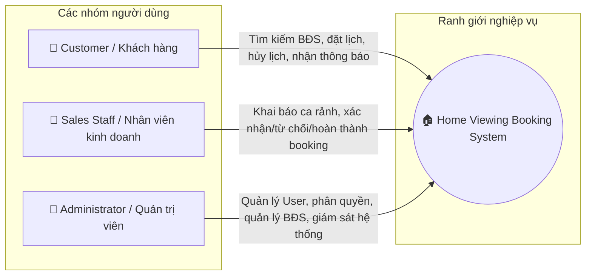
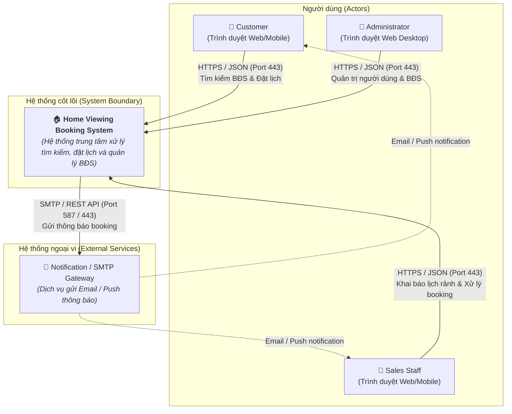
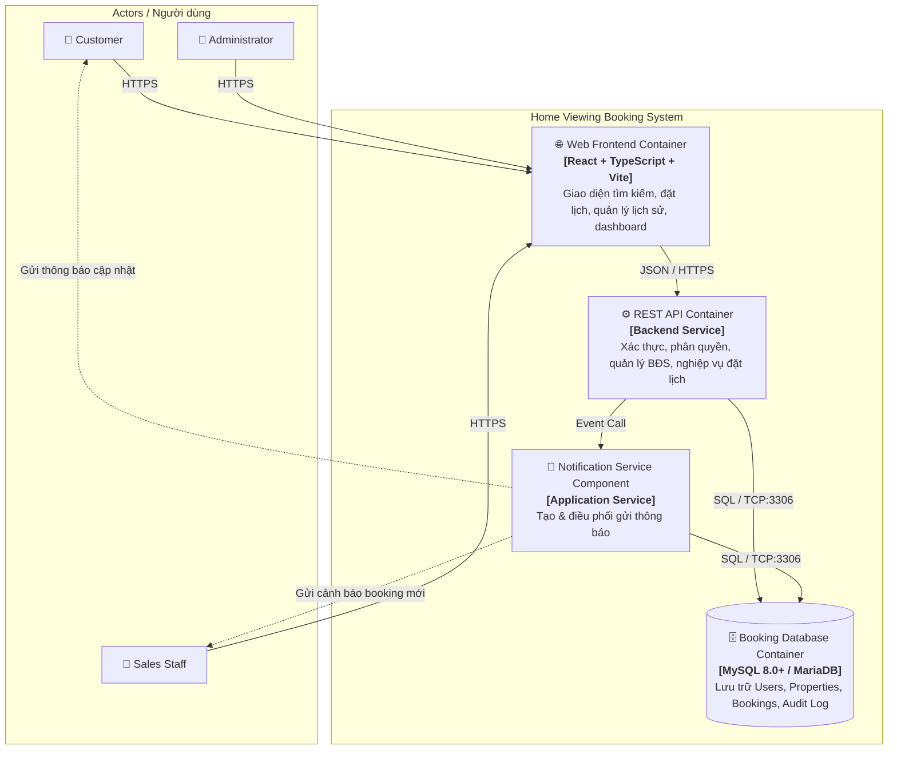
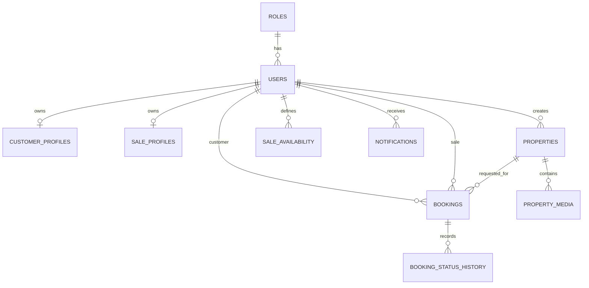
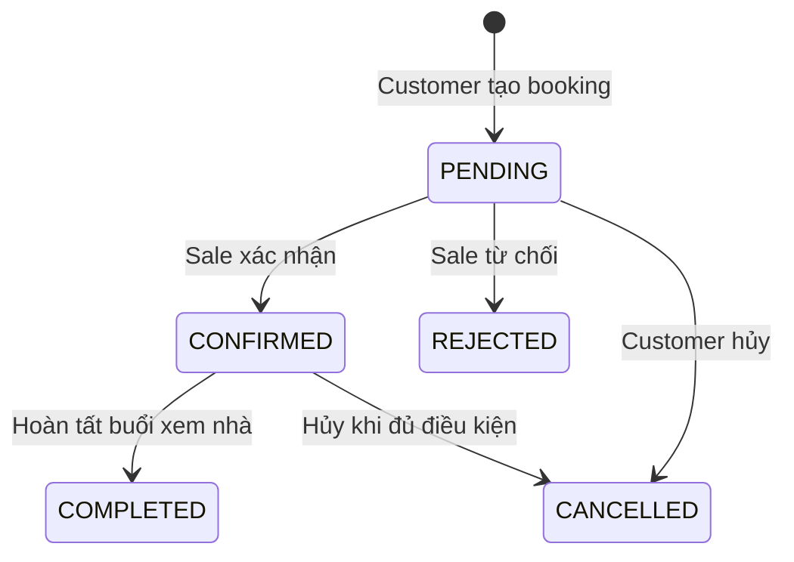
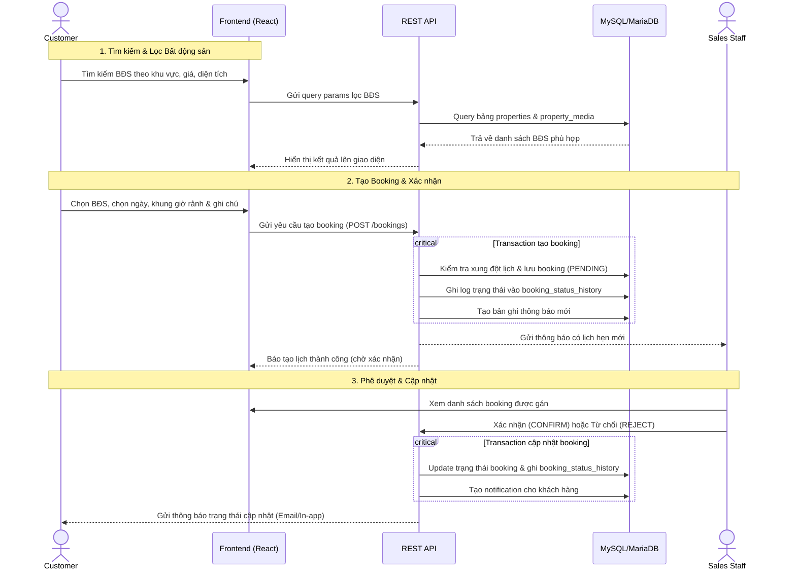
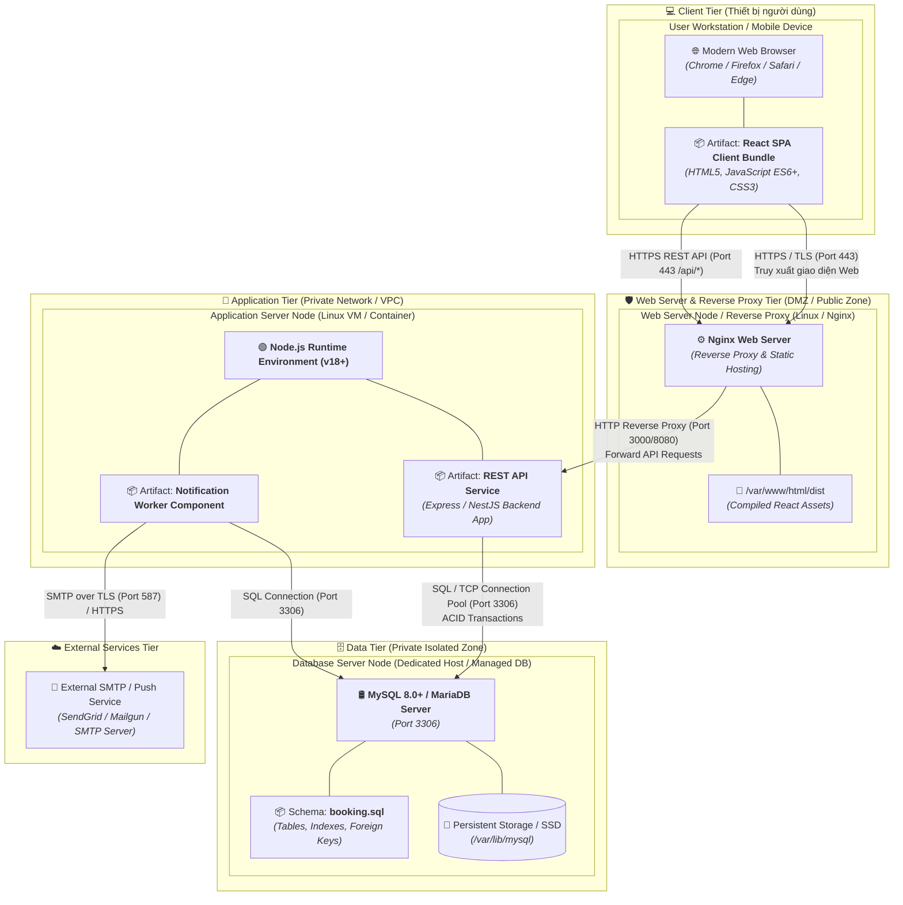

# 📐 TÀI LIỆU KIẾN TRÚC HỆ THỐNG (ARC42)
## Dự án: Home Viewing Booking System (Hệ thống Đặt lịch Xem Nhà)
* **Phiên bản:** Phase 1 (MVP)  
* **Trạng thái:** Prototype / Academic & Research

---

## 1. Giới thiệu và Mục tiêu (Introduction and Goals)

### 1.1. Tổng quan bài toán (Problem Statement)
Quy trình đặt lịch xem bất động sản truyền thống phụ thuộc chủ yếu vào gọi điện, nhắn tin rời rạc và ghi chép thủ công. Điều này dẫn đến:
* Trùng lặp lịch hẹn giữa khách hàng và nhân viên kinh doanh.
* Thông tin bất động sản và lịch biểu không đồng nhất.
* Thiếu khả năng theo dõi tiến trình/trạng thái lịch hẹn theo thời gian thực.
* Phản hồi chậm trễ tới khách hàng.

### 1.2. Mục tiêu hệ thống (System Goals)
Hệ thống **Home Viewing Booking System** tập trung số hóa và chuẩn hóa toàn bộ luồng quy trình nghiệp vụ:
$$\text{Tìm kiếm BĐS} \rightarrow \text{Xem chi tiết} \rightarrow \text{Chọn ngày/giờ} \rightarrow \text{Tạo Booking} \rightarrow \text{Sales xác nhận/từ chối} \rightarrow \text{Xem nhà} \rightarrow \text{Hoàn tất}$$

* **Mục tiêu Phase 1 (MVP):** Xây dựng quy trình đặt lịch xem nhà rõ ràng, theo dõi được (trackable), có thể mở rộng (extensible) mà không làm phức tạp hóa phạm vi MVP.

### 1.3. Các bên liên quan (Stakeholders)

| Bên liên quan (Role) | Kỳ vọng / Trách nhiệm chính |
| :--- | :--- |
| **Customer (Khách hàng)** | Đăng ký/đăng nhập, tìm kiếm & lọc BĐS, xem thông tin chi tiết, đặt lịch xem nhà, quản lý lịch sử đặt chỗ, hủy lịch khi đủ điều kiện, nhận thông báo. |
| **Sales Staff (Nhân viên Sale)** | Đăng nhập, thiết lập lịch rảnh (availability), tiếp nhận booking được phân bổ, phê duyệt/từ chối/hoàn thành lịch hẹn, ghi chú, xem thông tin khách hàng. |
| **Admin (Quản trị viên)** | Quản lý người dùng và phân quyền, kích hoạt/vô hiệu hóa tài khoản, quản lý danh sách & media BĐS, giám sát toàn bộ hoạt động và lịch sử booking. |

### 1.4. Mục tiêu chất lượng cốt lõi (Quality Goals)
1. **Tính nhất quán dữ liệu (Data Integrity):** Đảm bảo booking, lịch sử trạng thái và thông báo được ghi nhận đồng bộ qua Database Transaction.
2. **Trải nghiệm người dùng (Usability):** Luồng `Tìm kiếm → Xem BĐS → Đặt lịch` ngắn gọn, trực quan, hỗ trợ đa thiết bị (Desktop & Mobile).
3. **Khả năng mở rộng (Extensibility):** Kiến trúc phân tầng rõ ràng, sẵn sàng tích hợp các tính năng nâng cao (AI, đồng bộ Calendar) sau Phase 1.

---

## 2. Ràng buộc Kiến trúc (Architecture Constraints)

### 2.1. Ràng buộc kỹ thuật (Technical Constraints)
* **Frontend:** React 18+, TypeScript 5+, Vite, Responsive CSS.
* **Backend:** RESTful API kiến trúc phân tầng, kiểm soát truy cập dựa trên vai trò (RBAC).
* **Cơ sở dữ liệu:** MySQL 8.0+ hoặc MariaDB, bắt buộc sử dụng Foreign Keys, Indexes và ACID Transactions.
* **Node Environment:** Node.js 18+, Package Manager: `pnpm 8+` hoặc `npm 9+`.

### 2.2. Ràng buộc phạm vi Phase 1 (MVP Scope Constraints)
* **Trong phạm vi (In-Scope):** Quản lý RBAC (`ADMIN`, `SALE`, `CUSTOMER`), CRUD BĐS & media, bộ lọc BĐS, đặt lịch theo khung giờ rảnh của Sale, quản lý vòng đời trạng thái booking & lịch sử bất biến, hệ thống thông báo cơ bản.
* **Ngoài phạm vi Phase 1 (Out-of-Scope):** AI agents, tự động xếp hạng Sales, tối ưu hóa tuyến đường di chuyển, tự động dời lịch, đồng bộ Google/Outlook Calendar, phân tích hành vi người dùng, hệ thống đánh giá nâng cao.

---

## 3. Phạm vi & Ngữ cảnh Hệ thống (System Scope and Context)

### 3.1. Ngữ cảnh nghiệp vụ (Business Context)
Ngữ cảnh nghiệp vụ xác định ranh giới giữa hệ thống **Home Viewing Booking System** và các đối tượng người dùng tương tác trong quy trình đặt lịch xem nhà.



### 3.2. Ngữ cảnh kỹ thuật (Technical Context / C4 Level 1: System Context Diagram)
Ngữ cảnh kỹ thuật mô tả hệ thống ở cấp độ tổng thể (Black-Box), các kênh giao tiếp và giao thức kết nối với người dùng và các dịch vụ ngoại vi.



#### Bảng giao diện kỹ thuật (Technical Interfaces):

| Giao diện / Kênh | Giao thức / Port | Định dạng dữ liệu | Mục đích kết nối |
| :--- | :--- | :--- | :--- |
| **Web Client $\rightarrow$ System** | HTTPS / TLS (Port 443) | JSON / HTTP REST | Người dùng truy cập giao diện Web, gửi yêu cầu tìm kiếm và đặt lịch. |
| **System $\rightarrow$ Email Gateway** | SMTP / TLS (Port 587) hoặc HTTPS API | MIME / JSON | Gửi thông báo tự động (tạo booking, phê duyệt, từ chối, hủy lịch). |

---

## 4. Chiến lược Giải pháp (Solution Strategy)

| Khía cạnh kiến trúc | Quyết định kỹ thuật | Lý do / Lợi ích |
| :--- | :--- | :--- |
| **Kiến trúc ứng dụng** | Tách biệt Frontend (SPA) và Backend REST API | Đảm bảo tính độc lập, dễ dàng nâng cấp, chuẩn hóa giao tiếp qua giao thức HTTP/JSON. |
| **Giao diện người dùng** | React 18 + TypeScript + Vite | Tốc độ build/HMR nhanh, type-safe giảm thiểu lỗi runtime, component hóa giao diện. |
| **Lưu trữ & Dữ liệu** | MySQL 8.0+ / MariaDB (Relational DB) | Đảm bảo tính toàn vẹn dữ liệu quan hệ (FKs), hỗ trợ Transaction ACID cho đặt lịch. |
| **Tính bất biến lịch sử** | Bảng riêng `booking_status_history` | Ghi lại toàn bộ vết thay đổi trạng thái (ai đổi, lý do gì, lúc nào) phục vụ kiểm toán (audit trail). |
| **Xử lý đơn hàng (Booking)** | Xử lý gói gọn trong 1 Transaction | Kiểm tra trùng lịch $\rightarrow$ tạo booking `PENDING` $\rightarrow$ ghi log lịch sử $\rightarrow$ tạo notification. Tránh hiện tượng phân mảnh dữ liệu. |

---

## 5. Góc nhìn Khối Xây dựng (Building Block View)

### 5.1. Phân rã mức 1: Whitebox Hệ thống (C4 Level 2: Container View)
Hệ thống được phân rã thành các Container thực thi độc lập:



#### Trách nhiệm của từng Container:

| Container | Công nghệ | Trách nhiệm chính |
| :--- | :--- | :--- |
| **Web Frontend** | React, TypeScript, Vite | Thu thập dữ liệu tìm kiếm, hiển thị danh sách BĐS, form chọn ngày/giờ đặt lịch, ghi chú; hiển thị trạng thái và lịch sử booking theo từng vai trò. |
| **REST API** | Backend Service | Xác thực (Auth), kiểm tra ca rảnh của Sales, chống trùng lịch (conflict check), kiểm soát phân quyền (RBAC) và xác thực các bước chuyển trạng thái hợp lệ. |
| **Booking Database** | MySQL 8.0+ / MariaDB | Lưu trữ bền vững dữ liệu người dùng, BĐS, lịch rảnh và bảng lịch sử trạng thái bất biến (`booking_status_history`) để truy vết. |
| **Notification Service** | Application Service | Xử lý việc tạo và gửi thông báo cho khách hàng và nhân viên kinh doanh ngay khi có sự kiện booking phát sinh. |

> **Quy tắc giao dịch (Transaction Rule):** Thao tác đặt lịch chính phải được xử lý trọn vẹn trong một API Transaction: Kiểm tra slot trống $\rightarrow$ Tạo booking ở trạng thái `PENDING` $\rightarrow$ Ghi bản ghi lịch sử trạng thái ban đầu $\rightarrow$ Tạo sự kiện thông báo.

### 5.2. Phân rã mức 2: Mô hình Thực thể Dữ liệu (ERD)

```text
HOME BOOKING SYSTEM (Data Building Blocks)
├── 1. User Management Layer: roles, users, customer_profiles, sale_profiles
├── 2. Property Management Layer: properties, property_media
├── 3. Schedule Management Layer: sale_availability
└── 4. Booking & Notification Layer: bookings, booking_status_history, notifications
```



#### Trách nhiệm của các bảng dữ liệu:
* `roles` & `users`: Quản lý thông tin tài khoản, xác thực và phân quyền.
* `customer_profiles` / `sale_profiles`: Chứa thông tin chi tiết mở rộng theo từng vai trò.
* `properties` & `property_media`: Lưu trữ thông tin nhà đất (địa chỉ, giá, diện tích, phòng ngủ, tiện ích) và hình ảnh đính kèm.
* `sale_availability`: Khai báo khung giờ làm việc/rảnh của nhân viên sale theo ngày.
* `bookings`: Quản lý lịch hẹn xem nhà (`customer_id`, `property_id`, `sale_id`, ngày, khung giờ, ghi chú).
* `booking_status_history`: Ghi lại lịch sử chuyển trạng thái (trạng thái cũ/mới, actor, lý do, timestamp).
* `notifications`: Lưu trữ và đẩy thông báo trạng thái tới người dùng.

---

## 6. Góc nhìn Luồng thực thi (Runtime View)

### 6.1. Vòng đời trạng thái Booking (Booking State Machine)



Các trạng thái hợp lệ:
* `PENDING`: Khách hàng mới gửi yêu cầu, chờ nhân viên xác nhận.
* `CONFIRMED`: Nhân viên kinh doanh đồng ý tiếp nhận và chốt lịch hẹn.
* `REJECTED`: Nhân viên kinh doanh từ chối lịch hẹn.
* `CANCELLED`: Khách hàng hủy lịch (khi đang ở `PENDING` hoặc `CONFIRMED` hợp lệ).
* `COMPLETED`: Buổi xem nhà đã diễn ra thành công.

### 6.2. Sơ đồ tuần tự: Luồng Đặt lịch & Xử lý Booking (Sequence Diagram)



---

## 7. Góc nhìn Triển khai (Deployment View)

Góc nhìn triển khai mô tả hạ tầng vật lý/logic, các môi trường thực thi (Execution Environments), cách các phần mềm/tạo phẩm (Artifacts) được phân bổ lên các Node mạng và các giao thức kết nối.

### 7.1. Sơ đồ Kiến trúc Triển khai (Deployment Diagram)



### 7.2. Ánh xạ Phần mềm sang Node Hạ tầng (Container to Node Mapping)

| Software Container / Component | Deployed Artifact | Target Infrastructure Node | Execution Environment | Port & Protocol |
| :--- | :--- | :--- | :--- | :--- |
| **Web Frontend** | `dist/` (HTML, JS, CSS) | Web Server (Static Hosting / CDN) | Web Browser (Client-side) | `443` (HTTPS) |
| **Reverse Proxy** | Nginx Config (`nginx.conf`) | Web Server / Edge Gateway | Nginx 1.20+ | `80` (HTTP) $\rightarrow$ `443` (HTTPS) |
| **REST API** | Backend Service Application | App Server (VM / Docker Container) | Node.js 18+ LTS | `3000` / `8080` (Internal HTTP) |
| **Notification Service** | Notification Worker Module | App Server (VM / Worker Process) | Node.js Runtime | Internal Event / Async Queue |
| **Booking Database** | `database/booking.sql` schema | Database Server Node | MySQL 8.0+ / MariaDB Engine | `3306` (Internal TCP/IP) |

### 7.3. Phân vùng Mạng và Bảo mật (Network & Security Zones)

1. **Public Zone (Internet):** Người dùng (Customer, Sales, Admin) truy cập thông qua kết nối mã hóa **HTTPS/TLS 1.3** trên Port `443`.
2. **DMZ / Edge Zone:** Nginx tiếp nhận traffic công khai, phục vụ static bundle cho React SPA và làm Reverse Proxy chuyển tiếp các request `/api/*` vào Application Server.
3. **Private Application Zone (Internal Network / VPC):** Chứa Node.js Application Server. Node này không mở port công khai ra ngoài Internet; chỉ nhận request nội bộ từ Nginx Reverse Proxy.
4. **Isolated Data Zone:** MySQL Database nằm trong mạng nội bộ cô lập, chỉ cho phép kết nối đến từ Application Server thông qua whitelist IP và mật khẩu mã hóa trên port `3306`.

### 7.4. Môi trường Triển khai (Deployment Environments)

#### Môi trường Phát triển (Development Environment - Localhost):
* **Frontend:** Chạy trực tiếp qua Vite Dev Server trên máy dev (`http://localhost:5173`).
* **Database:** Local MySQL/MariaDB server (`localhost:3306`).
* **Khởi chạy:**
  ```bash
  # 1. Cài đặt và chạy Frontend
  cd frontend
  pnpm install
  pnpm dev

  # 2. Khởi tạo Database schema
  mysql -u <username> -p <database_name> < database/booking.sql
  ```

#### Môi trường Đóng gói / Triển khai Production (Production Environment):
* **Frontend Build:** `pnpm build` xuất ra thư mục tĩnh `frontend/dist`.
* **Deploy Frontend:** Copy `dist/` vào web root của Nginx (`/var/www/html/dist`).
* **Database Migration:** Chạy script `database/booking.sql` trên production database instance.

---

## 8. Các Khái niệm Xuyên suốt (Cross-cutting Concepts)

### 8.1. Bảo mật và Phân quyền (Security & RBAC)
* Phân quyền 3 cấp bậc nghiêm ngặt:
  * `CUSTOMER`: Chỉ xem và thao tác trên booking cá nhân và danh sách BĐS công khai.
  * `SALE`: Chỉ xem/thao tác trên lịch rảnh của mình và các booking được gán.
  * `ADMIN`: Toàn quyền quản trị tài khoản, danh mục BĐS và giám sát toàn hệ thống.

### 8.2. Tính toàn vẹn giao dịch (Transaction & Data Consistency)
* Thao tác tạo/hủy/cập nhật booking bắt buộc phải bao bọc trong một **Database Transaction** duy nhất nhằm ngăn chặn tình trạng booking được tạo nhưng lịch sử trạng thái hoặc thông báo bị mất mát.

### 8.3. Thiết kế luồng UI/UX (UI/UX Concept)
* **Luồng khách hàng tinh gọn:** `Home → Property Search → Property List → Property Details → Select Date & Time → Booking Confirmation → Booking Status`
* **Màn hình chính:**
  * *Home/Search & Property List:* Tìm kiếm theo quận huyện, mức giá, số phòng ngủ, diện tích.
  * *Property Details:* Trình chiếu hình ảnh (gallery), thông số, địa chỉ và nút bấm đặt lịch.
  * *My Bookings:* Danh sách lịch hẹn, nhãn trạng thái trực quan, chức năng hủy lịch.
  * *Sales Dashboard:* Lịch làm việc theo ngày, danh sách khách hàng và nút duyệt lịch nhanh.

---

## 9. Quyết định Kiến trúc (Architectural Decision Records - ADR)

### ADR-01: Tách rời bảng `booking_status_history`
* **Ngữ cảnh:** Cần theo dõi tiến trình lịch hẹn và giải quyết tranh chấp thông tin giữa Khách hàng và Sales.
* **Quyết định:** Sử dụng bảng lịch sử riêng dạng append-only, ghi lại trạng thái trước/sau, người thực hiện (actor), thời gian và lý do.

### ADR-02: Giới hạn phạm vi Phase 1 (MVP)
* **Ngữ cảnh:** Tránh rủi ro kéo dài tiến độ phát triển hệ thống ban đầu.
* **Quyết định:** Tạm thời loại bỏ các thành phần phức tạp (AI Agent, Calendar Sync, Route Optimization) để tập trung hoàn thiện luồng booking cốt lõi.

---

## 10. Yêu cầu Chất lượng (Quality Requirements)

| Yêu cầu chất lượng | Tiêu chí đánh giá |
| :--- | :--- |
| **Reliability (Độ tin cậy)** | Không xảy ra hiện tượng double-booking (trùng lịch trên cùng một khung giờ của Sales). |
| **Usability (Khả năng sử dụng)** | Luồng đặt lịch hoàn tất trong tối đa 3-4 bước; giao diện tương thích tốt trên cả Mobile và Desktop. |
| **Maintainability (Khả năng bảo trì)** | Mã nguồn Frontend viết bằng TypeScript với type rõ ràng; cơ sở dữ liệu chuẩn hóa quan hệ (3NF). |
| **Auditability (Khả năng kiểm toán)** | 100% thay đổi trạng thái booking đều được lưu vết kèm actor và timestamp. |

---

## 11. Rủi ro và Nợ kỹ thuật (Risks and Technical Debt)

* **Thiếu Backend Source Code trong Repo hiện tại:** Repository hiện tại chỉ gồm source Frontend và script database (`database/booking.sql`), cần sớm triển khai REST API backend theo đặc tả.
* **Xung đột khung giờ đặt lịch (Race Condition):** Khi nhiều khách hàng cùng đặt 1 khung giờ của 1 Sales tại cùng một thời điểm, backend cần cơ chế database lock hoặc transaction isolation phù hợp để tránh conflict.
* **Kênh thông báo:** Phase 1 mới định nghĩa tầng notification cơ bản; cần tích hợp kênh gửi thực tế (Email SMTP / Web Push / SMS) ở giai đoạn tiếp theo.

---

## 12. Thuật ngữ (Glossary)

* **RBAC (Role-Based Access Control):** Kiểm soát truy cập dựa trên vai trò người dùng (`ADMIN`, `SALE`, `CUSTOMER`).
* **Booking Lifecycle:** Chu kỳ sống của một lịch hẹn từ lúc khởi tạo (`PENDING`) đến khi kết thúc (`COMPLETED`/`CANCELLED`/`REJECTED`).
* **Availability Slot:** Khung thời gian làm việc rảnh mà Sales khai báo để khách hàng có thể đặt lịch.
* **Status History / Audit Log:** Nhật ký ghi vết bất biến các lần đổi trạng thái của lịch hẹn.

