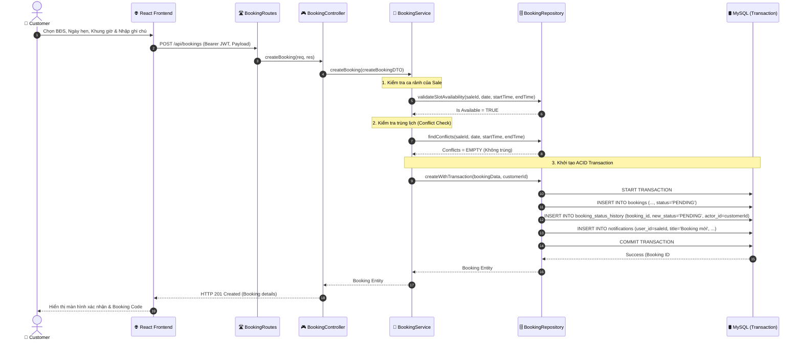

# 🏗️ TÀI LIỆU THIẾT KẾ CHI TIẾT KIẾN TRÚC & MÃ NGUỒN (DETAILED DESIGN)
## Dự án: Home Viewing Booking System (Hệ thống Đặt lịch Xem Nhà)

---

## 📁 1. Cấu trúc thư mục chuẩn (Folder Structures)

### 1.1. Cấu trúc thư mục Frontend (ReactJS + TypeScript + Vite)
Được tổ chức theo kiến trúc module hóa (**Clean Component Architecture**):

```text
frontend/
├── public/                     # Static assets (favicon, logos, etc.)
├── src/
│   ├── assets/                 # Images, icons, svg resources
│   ├── components/             # Reusable UI components
│   │   ├── common/             # Button, Modal, Input, Spinner, Badge, Alert
│   │   ├── layout/             # Header, Footer, Sidebar, Navbar
│   │   ├── property/           # PropertyCard, PropertyFilter, PropertyGallery
│   │   └── booking/            # BookingCard, BookingForm, TimeSlotPicker, StatusBadge
│   ├── contexts/               # React Contexts (AuthContext, ThemeContext, NotificationContext)
│   ├── hooks/                  # Custom hooks (useAuth, useBookings, useProperties, useDebounce)
│   ├── pages/                  # Page route components
│   │   ├── auth/               # LoginPage, RegisterPage
│   │   ├── customer/           # HomePage, PropertyDetailPage, MyBookingsPage, BookingCreatePage
│   │   ├── sales/              # SalesDashboardPage, AvailabilityManagementPage, BookingProcessPage
│   │   └── admin/              # AdminDashboardPage, UserManagementPage, PropertyManagementPage
│   ├── services/               # API client services (Axios / Fetch instances)
│   │   ├── api.ts              # Base Axios instance with interceptors (JWT Token injection & 401 handler)
│   │   ├── auth.service.ts     # login(), register(), getProfile()
│   │   ├── property.service.ts # getProperties(), getPropertyById(), createProperty()
│   │   ├── booking.service.ts  # createBooking(), getBookings(), updateBookingStatus()
│   │   ├── sale.service.ts     # getAvailability(), setAvailability()
│   │   └── notification.service.ts # getNotifications(), markAsRead()
│   ├── types/                  # TypeScript models and DTO interfaces
│   │   ├── user.types.ts
│   │   ├── property.types.ts
│   │   ├── booking.types.ts
│   │   └── api.types.ts
│   ├── utils/                  # Helper utilities (formatters, dateUtils, constants, validators)
│   ├── App.tsx                 # Root router & layout wrapper
│   ├── main.tsx                # Application bootstrap entry point
│   └── index.css               # Global Tailwind CSS styles
├── package.json
├── tsconfig.json
└── vite.config.ts
```

---

### 1.2. Cấu trúc thư mục Backend (3-Tier Layered Architecture)
Được tổ chức theo chuẩn **3-Tier Architecture (Presentation Layer $\rightarrow$ Business Logic Layer $\rightarrow$ Data Access Layer)**:

```text
backend/
├── src/
│   ├── config/                 # Configuration & environment setup
│   │   ├── database.ts         # MySQL connection pool & Transaction runner helper
│   │   └── env.ts              # Environment variables typed validation (PORT, DB_*, JWT_SECRET)
│   │
│   ├── types/                  # Data models, DTOs and common interfaces
│   │   ├── user.types.ts       # User, Role, Profile types
│   │   ├── property.types.ts   # Property, PropertyMedia, PropertyFilter types
│   │   ├── booking.types.ts    # Booking, BookingStatus, BookingStatusHistory types
│   │   ├── availability.types.ts # SaleAvailability types
│   │   └── common.types.ts     # ApiResponse, Pagination, AuthTokenPayload types
│   │
│   ├── repositories/           # Tier 3: Data Access Layer (Direct SQL & Transactions)
│   │   ├── user.repository.ts
│   │   ├── property.repository.ts
│   │   ├── availability.repository.ts
│   │   ├── booking.repository.ts
│   │   └── notification.repository.ts
│   │
│   ├── services/               # Tier 2: Business Logic Layer (Rules, Transactions & Validations)
│   │   ├── auth.service.ts     # Password hashing, JWT issuance, User registration/login logic
│   │   ├── property.service.ts # Filter logic, property details aggregation
│   │   ├── availability.service.ts # Sales availability slots calculations
│   │   ├── booking.service.ts  # CORE LOGIC: Conflict check, availability check, status state-machine
│   │   └── notification.service.ts # User notification dispatching
│   │
│   ├── controllers/            # Tier 1: Presentation Layer (HTTP Request/Response Handling)
│   │   ├── auth.controller.ts
│   │   ├── property.controller.ts
│   │   ├── availability.controller.ts
│   │   ├── booking.controller.ts
│   │   ├── notification.controller.ts
│   │   └── admin.controller.ts
│   │
│   ├── middlewares/            # Express Middlewares
│   │   ├── auth.middleware.ts  # JWT Verification
│   │   ├── role.middleware.ts  # RBAC permission check (ADMIN, SALE, CUSTOMER)
│   │   ├── validate.middleware.ts # Zod schema request validation
│   │   └── error.middleware.ts # Global error handling & standard JSON response formatting
│   │
│   ├── routes/                 # Express API Route Definitions
│   │   ├── auth.routes.ts
│   │   ├── property.routes.ts
│   │   ├── availability.routes.ts
│   │   ├── booking.routes.ts
│   │   ├── notification.routes.ts
│   │   ├── admin.routes.ts
│   │   └── index.ts            # Master API router aggregator (/api/*)
│   │
│   ├── app.ts                  # Express application setup (cors, json parser, routes, error handler)
│   └── server.ts               # Server startup entry point (listen on port)
│
├── tests/                      # Automated Test Suites
│   └── services/
│       ├── booking.service.test.ts # Conflict test, Status transition test, Transaction test
│       ├── auth.service.test.ts    # Authentication & JWT test
│       └── property.service.test.ts # Filtering logic test
│
├── .env.example
├── package.json
├── tsconfig.json
└── vitest.config.ts
```

---

## 📐 2. Sơ đồ Lớp Kỹ thuật (Class Diagram - 3-Tier Architecture)

Sơ đồ lớp thể hiện sự phân tách trách nhiệm giữa 3 tầng: **Controller $\rightarrow$ Service $\rightarrow$ Repository $\rightarrow$ Database**:

```mermaid
classDiagram
    %% Presentation Tier (Controllers)
    class BookingController {
        -bookingService: BookingService
        +createBooking(req: Request, res: Response): Promise~void~
        +getBookings(req: Request, res: Response): Promise~void~
        +getBookingById(req: Request, res: Response): Promise~void~
        +updateStatus(req: Request, res: Response): Promise~void~
    }

    class PropertyController {
        -propertyService: PropertyService
        +getProperties(req: Request, res: Response): Promise~void~
        +getPropertyById(req: Request, res: Response): Promise~void~
        +createProperty(req: Request, res: Response): Promise~void~
    }

    class AuthController {
        -authService: AuthService
        +register(req: Request, res: Response): Promise~void~
        +login(req: Request, res: Response): Promise~void~
        +getProfile(req: Request, res: Response): Promise~void~
    }

    %% Business Logic Tier (Services)
    class BookingService {
        -bookingRepo: BookingRepository
        -availabilityRepo: AvailabilityRepository
        -notificationRepo: NotificationRepository
        +createBooking(data: CreateBookingDTO): Promise~Booking~
        +getBookingsByUser(userId: number, role: string, status?: string): Promise~Booking[]~
        +getBookingDetail(bookingId: number, userId: number, role: string): Promise~BookingDetail~
        +updateBookingStatus(bookingId: number, newStatus: BookingStatus, actorId: number, actorRole: string, reason?: string): Promise~Booking~
        -validateSlotAvailability(saleId: number, date: string, startTime: string, endTime: string): Promise~boolean~
        -checkBookingConflict(saleId: number, date: string, startTime: string, endTime: string): Promise~boolean~
        -validateStateTransition(currentStatus: BookingStatus, newStatus: BookingStatus, actorRole: string): boolean
    }

    class PropertyService {
        -propertyRepo: PropertyRepository
        +searchProperties(filter: PropertyFilterDTO): Promise~PaginatedResult~
        +getPropertyDetails(id: number): Promise~PropertyDetail~
        +createProperty(data: CreatePropertyDTO, adminId: number): Promise~Property~
    }

    class AuthService {
        -userRepo: UserRepository
        +register(data: RegisterDTO): Promise~AuthResult~
        +login(credentials: LoginDTO): Promise~AuthResult~
        +getUserProfile(userId: number): Promise~UserProfile~
        -generateToken(user: User): string
    }

    %% Data Access Tier (Repositories)
    class BookingRepository {
        -pool: Pool
        +findById(id: number): Promise~Booking~
        +findByCustomer(customerId: number, status?: string): Promise~Booking[]~
        +findBySale(saleId: number, status?: string): Promise~Booking[]~
        +findAll(status?: string): Promise~Booking[]~
        +findConflicts(saleId: number, date: string, startTime: string, endTime: string): Promise~Booking[]~
        +createWithTransaction(data: CreateBookingDTO, actorId: number): Promise~Booking~
        +updateStatusWithHistory(bookingId: number, oldStatus: string, newStatus: string, actorId: number, reason?: string): Promise~void~
        +getStatusHistory(bookingId: number): Promise~BookingStatusHistory[]~
    }

    class PropertyRepository {
        -pool: Pool
        +findAll(filter: PropertyFilterDTO): Promise~Property[]~
        +count(filter: PropertyFilterDTO): Promise~number~
        +findById(id: number): Promise~PropertyDetail~
        +create(data: CreatePropertyDTO): Promise~Property~
        +addMedia(propertyId: number, mediaUrls: string[]): Promise~void~
    }

    class UserRepository {
        -pool: Pool
        +findByEmail(email: string): Promise~User~
        +findById(id: number): Promise~UserProfile~
        +create(user: CreateUserDTO): Promise~User~
        +updateActiveStatus(id: number, isActive: boolean): Promise~void~
    }

    %% Relationships
    BookingController --> BookingService : delegates to
    PropertyController --> PropertyService : delegates to
    AuthController --> AuthService : delegates to

    BookingService --> BookingRepository : persists through
    PropertyService --> PropertyRepository : queries through
    AuthService --> UserRepository : queries through
```



---

## 🔄 3. Sơ đồ Tuần tự Chi tiết (Detailed Sequence Diagrams)

### 3.1. Luồng Tạo Đặt Lịch Xem Nhà (Transaction Booking Creation)



---

### 3.2. Luồng Chuyển Trạng thái (Status Transition State Machine)

```mermaid
sequenceDiagram
    autonumber
    actor Actor as 👤 Sales / Customer / Admin
    participant Ctrl as 🎮 BookingController
    participant Svc as 🧠 BookingService
    participant Repo as 🗄️ BookingRepository
    participant DB as 🛢️ MySQL

    Actor->>Ctrl: PATCH /api/bookings/{id}/status { status, reason }
    Ctrl->>Svc: updateBookingStatus(bookingId, newStatus, actorId, actorRole, reason)
    
    Svc->>Repo: findById(bookingId)
    Repo-->>Svc: Current Booking (Status: PENDING)

    Note over Svc: Kiểm tra ma trận chuyển trạng thái & Quyền
    alt Trạng thái hợp lệ (VD: PENDING -> CONFIRMED bởi SALE)
        Svc->>Repo: updateStatusWithHistory(bookingId, 'PENDING', 'CONFIRMED', actorId, reason)
        Repo->>DB: START TRANSACTION
        Repo->>DB: UPDATE bookings SET status='CONFIRMED' WHERE id=bookingId
        Repo->>DB: INSERT INTO booking_status_history (booking_id, old_status='PENDING', new_status='CONFIRMED', actor_id, reason)
        Repo->>DB: INSERT INTO notifications (user_id=customerId, title='Lịch hẹn đã được xác nhận')
        Repo->>DB: COMMIT
        DB-->>Repo: Success
        Repo-->>Svc: Updated Booking
        Svc-->>Ctrl: Updated Booking
        Ctrl-->>Actor: HTTP 200 OK
    else Trạng thái bất hợp lệ (VD: COMPLETED -> CANCELLED)
        Svc-->>Ctrl: Throw InvalidStateTransitionError ("Không thể hủy lịch đã hoàn thành")
        Ctrl-->>Actor: HTTP 400 Bad Request
    end
```
